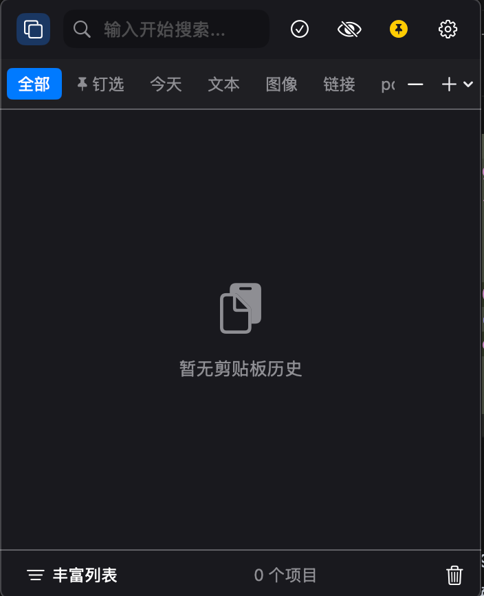
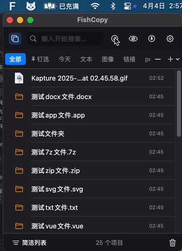

<div align="center">
  <h1 style="font-size: 6em; font-weight: 900; background: linear-gradient(to right, #12c2e9, #c471ed, #f64f59); -webkit-background-clip: text; background-clip: text; color: transparent; text-shadow: 0 4px 8px rgba(0,0,0,0.2); margin-bottom: 0; letter-spacing: -2px; transform: perspective(500px) rotateX(10deg); font-family: 'Arial Black', Gadget, sans-serif;">FishPaste</h1>
  <p style="margin-top: -10px; font-size: 1.5em; font-weight: bold; background: linear-gradient(to right, #12c2e9, #c471ed); -webkit-background-clip: text; background-clip: text; color: transparent; letter-spacing: 3px;">优雅的剪贴板管理</p>
</div>

<p align="center">
  <a href="https://github.com/Auroral0810/FishPaste"></a>
  <a href="https://swift.org"></a>
  <a href="https://opensource.org/licenses/MIT"></a>
</p>

<h3 align="center">🐠 功能强大的智能剪贴板管理工具</h3>

<p align="center">
  <em>让您的复制粘贴体验如鱼得水</em>
</p>

<p align="center">
  <a href="#-应用概览">概览</a> •
  <a href="#-主要特性">特性</a> •
  <a href="#-已实现功能一览">已实现功能</a> •
  <a href="#-开发计划-todo-list">开发计划</a> •
  <a href="#-安装方法">安装</a> •
  <a href="#-使用方法">使用</a> •
  <a href="#-使用场景">使用场景</a> •
  <a href="#-贴士与技巧">技巧</a>
</p>

---

## 📱 应用概览

FishPaste是一款功能强大的macOS剪贴板增强工具，专为提升您的工作效率和创意流程而设计。通过智能记录、分类和管理剪贴板内容，FishPaste让您的复制粘贴体验更加流畅和高效。

本项目受[PasteNow](https://pastenow.app/)启发，重新实现并扩展了其核心功能，同时添加了更多创新特性和优化体验。作为一个个人开发的项目，FishPaste致力于打造一款功能全面、界面美观、使用体验出色的剪贴板管理工具。

FishPaste已经实现了PasteNow的基本功能，包括：批量复制、粘贴功能，无限历史记录，自定义快捷键，支持文本、图片、文件等多种格式，搜索功能，自定义分类，支持排除规则，音效反馈，丰富列表样式，窗口前置固定，自定义监控板时间间隔，高效数据库操作，开机自启动，GPU图像加速，拖拽粘贴，智能列表，内容编辑，添加标题等功能，并作为macOS原生应用提供了流畅的用户体验。

<div align="center">
  
</div>


## 📋 已实现功能一览

FishPaste作为PasteNow的重新实现，已经完成并优化了以下所有核心功能：

<table>
  <tr>
    <td width="33%">✅ 批量复制、粘贴</td>
    <td width="33%">✅ 无限历史记录</td>
    <td width="33%">✅ 自定义快捷键</td>
  </tr>
  <tr>
    <td width="33%">✅ 多种格式支持(文本/图片/文件)</td>
    <td width="33%">✅ 搜索功能</td>
    <td width="33%">✅ 自定义分类</td>
  </tr>
  <tr>
    <td width="33%">✅ 应用排除规则</td>
    <td width="33%">✅ 操作音效反馈</td>
    <td width="33%">✅ 丰富列表样式</td>
  </tr>
  <tr>
    <td width="33%">✅ 窗口前置固定</td>
    <td width="33%">✅ 自定义监控时间间隔</td>
    <td width="33%">✅ 高效数据库操作</td>
  </tr>
  <tr>
    <td width="33%">✅ 开机自启动</td>
    <td width="33%">✅ GPU图像加速</td>
    <td width="33%">✅ 拖拽粘贴</td>
  </tr>
  <tr>
    <td width="33%">✅ 智能列表</td>
    <td width="33%">✅ 内容编辑</td>
    <td width="33%">✅ 添加标题</td>
  </tr>
  <tr>
    <td width="33%">✅ macOS原生应用</td>
    <td width="33%">✅ 深色模式支持</td>
    <td width="33%">✅ 毛玻璃UI效果</td>
  </tr>
</table>

## 🎯 开发计划 (TODO List)

以下是FishPaste计划开发的功能：

- [ ] 📊 **批量粘贴混合类型数据**：支持同时粘贴多种不同类型的内容
- [ ] 🔍 **模糊搜索**：智能匹配相似内容，提高搜索效率
- [ ] 🔗 **自动获取链接标题**：复制URL时自动提取网页标题作为描述
- [ ] 📌 **新的"置顶窗口功能"**：更灵活的窗口置顶方式和自定义设置
- [ ] 🎨 **HEX颜色识别**：识别文本中的颜色代码并提供预览
- [ ] ⌨️ **快捷键映射**：更强大的快捷键自定义功能
- [ ] ☁️ **Cloud同步**：跨设备同步剪贴板内容（受经费限制）
- [ ] 🍎 **忽略iOS复制功能**：可选择性忽略来自iOS设备的复制内容
- [ ] 📤 **分享功能**：支持将内容分享到社交媒体和其他应用
- [ ] 👁️ **预览功能**：增强的内容预览体验
- [ ] 📋 **添加到列表**：更便捷的内容分类管理方式
- [ ] 🔄 **复制格式选择**：支持选择不同格式进行复制粘贴

我们欢迎社区贡献，一起打造更强大的剪贴板工具！

## 🎨 视觉体验亮点

<table>

  <tr>
    <td width="50%">
      
    </td>
    <td width="50%">
      <h3>✨ 微交互细节</h3>
      <ul>
        <li>项目卡片有精致的悬停效果和阴影变化</li>
        <li>复制成功时的愉悦反馈动画</li>
        <li>列表滚动时的平滑物理惯性效果</li>
        <li>状态切换时的细腻过渡动画</li>
      </ul>
    </td>
  </tr>
</table>

## 📥 安装方法

### 方法一：直接下载

<div align="center">
  <a href="https://github.com/Auroral0810/FishPaste/releases/latest">
    
  </a>
</div>

1. 点击上方按钮下载最新版本的DMG文件
2. 打开DMG文件并将应用拖动到应用程序文件夹
3. 从应用程序文件夹启动FishPaste

### 方法二：使用Homebrew安装

```bash
brew install --cask FishPaste
```

## 🚀 使用方法

<table>
  <tr>
    <td><b>1</b></td>
    <td>从菜单栏访问FishPaste图标</td>
    <td rowspan="5"></td>
  </tr>
  <tr>
    <td><b>2</b></td>
    <td>查看最近复制的内容</td>
  </tr>
  <tr>
    <td><b>3</b></td>
    <td>点击任意项目将其复制到剪贴板</td>
  </tr>
  <tr>
    <td><b>4</b></td>
    <td>使用主窗口(⌘+O)管理所有剪贴板历史</td>
  </tr>
  <tr>
    <td><b>5</b></td>
    <td>创建分类整理您的内容</td>
  </tr>
</table>

## 💼 使用场景

<details>
<summary><b>💻 开发者</b></summary>
<ul>
  <li>保存代码片段和常用命令</li>
  <li>跟踪API密钥和配置信息</li>
  <li>在多个项目间快速切换和复用代码</li>
</ul>
</details>

<details>
<summary><b>✏️ 作家和编辑</b></summary>
<ul>
  <li>整理研究材料和引用</li>
  <li>保存多个版本的文稿片段</li>
  <li>收集灵感和素材</li>
</ul>
</details>

<details>
<summary><b>🏢 日常办公</b></summary>
<ul>
  <li>管理联系人信息</li>
  <li>保存会议笔记和要点</li>
  <li>整理待办事项</li>
</ul>
</details>

## 💡 贴士与技巧

| 🔰 初级技巧 | 🔮 高级技巧 |
|------------|------------|
| 使用钉选功能固定常用内容 | 设置自定义快捷键组合，提高工作效率 |
| 为不同类型的内容创建分类 | 利用智能列表自动整理不同类型内容 |
| 使用右键菜单进行快速操作 | 配置应用排除列表，避免记录敏感信息 |
| 使用全局搜索快速找到内容 | 将FishPaste与其他工具集成使用 |
| 拖放图像到主窗口进行保存 | 利用API接口进行自动化操作 |

## 💻 系统要求

- macOS 12.0 或更高版本
- 约20MB磁盘空间
- 兼容Apple Silicon和Intel芯片

## 🔐 隐私声明

FishPaste尊重您的隐私:
- 所有数据均存储在本地设备上
- 没有远程服务器通信
- 可设置应用排除列表避免记录敏感信息
- 可随时清除历史数据

## 🙋‍♀️ 常见问题

<details>
<summary><b>FishPaste会影响系统性能吗？</b></summary>
<p>FishPaste经过高度优化，资源占用极低。即使在低配置设备上，也能保持流畅运行，不会明显影响系统性能。</p>
</details>

<details>
<summary><b>FishPaste会记录哪些内容？</b></summary>
<p>FishPaste默认会记录所有复制到系统剪贴板的内容，包括文本、图像和文件路径。您可以在设置中配置应用排除列表，避免记录特定应用中的敏感信息。</p>
</details>

<details>
<summary><b>我的剪贴板数据安全吗？</b></summary>
<p>FishPaste所有数据均保存在本地设备，不会上传到任何服务器。您的剪贴板数据安全性取决于您设备的安全性。</p>
</details>

<details>
<summary><b>如何删除历史记录？</b></summary>
<p>您可以在主窗口中选择单个项目进行删除，也可以在设置中选择"清除所有历史记录"一次性删除所有数据。</p>
</details>

## 🤝 贡献

欢迎提交问题报告和功能建议！如果您想为FishPaste做出贡献，请参阅我们的[贡献指南](CONTRIBUTING.md)。

## 📄 许可证

FishPaste 采用 [MIT 许可证](LICENSE)。

---

<p align="center">
  FishPaste © 2025 Yunfeng Yu. 保留所有权利。
</p>

<p align="center">
  <a href="#">官方网站</a> • 
  <a href="#">使用手册</a> • 
  <a href="#">支持</a> •
  <a href="#">反馈建议</a>
</p>

<p align="center">
  
</p> 